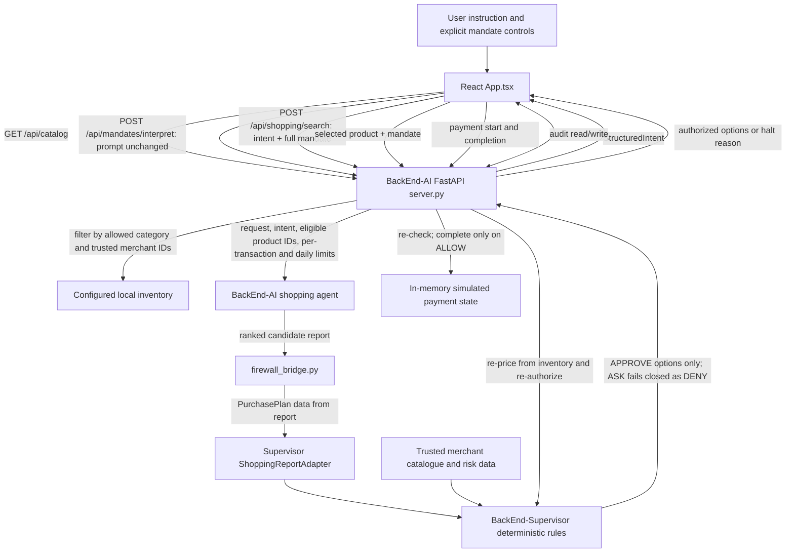

# Integration map and debugging notes

This document is the cross-module reference for the merged demo. Component
setup and internal algorithms remain in the individual module READMEs.

## End-to-end data flow

The supervisor is a Python library imported by BackEnd-AI, not a separate
network service. The bridge writes an intermediate JSON report, lets the
supervisor adapter parse it, then returns only candidates that the firewall
approved. `ASK` is intentionally unsupported in the UI and is treated as
denial at the API boundary and during payment completion.

### Mandate contract across the boundary

1. `POST /api/mandates/interpret` receives only `{ "prompt": string }`; the
   prompt is not rewritten with UI limits.
2. The frontend gateway combines the `StructuredIntent` with explicit user
   overrides. A parsed base-price cap stays a base-price cap; it is not
   converted into a final-total mandate cap.
3. `POST /api/shopping/search` receives `{ intent, mandate, max_results }`.
   BackEnd-AI applies category and trusted merchant filters to inventory
   product IDs and forwards the user's transaction/day limits to the bridge.
4. A selected product is submitted to `/api/authorization/evaluate`. BackEnd-AI
   re-prices it from the configured inventory and checks category, trusted
   merchant, expiry, revocation, transaction limit, daily limit, and merchant
   risk. An `ALLOW` stores the mandate and transaction snapshot in the API
   process.
5. Payment start and completion require that snapshot and reject changed
   transaction identity/amount fields. Completion re-evaluates using the
   stored mandate (not a relaxed client resend); only `ALLOW` can produce
   `COMPLETED`. Other results, including unsupported `ASK`, produce
   `CANCELLED`.

## Current demonstration data and live-data replacement points

| Data/source | Status | Where to replace it |
|---|---|---|
| `BackEnd-AI/wireless_mouse_ecosystem.json` | **Demo inventory** (200 fixed product rows), loaded at runtime; it is not live retailer data. | Set `runtime.inventory_file` in `BackEnd-AI/config.json` to the new source file or replace `load_products()` with the live catalogue adapter. Add trustworthy category and observation fields to the product model before mapping them in `server.py:get_catalog()`. |
| `BackEnd-Supervisor/samples/merchant_catalog.json` | **Seed/test merchant mappings and risk scores.** | Replace with an authoritative merchant registry or risk service and update `BackEnd-AI/server.py:_merchant_catalog()` / `firewall_bridge.py:build_merchant_directory()`. Do not infer scores from product text or brand names. |
| Generated `BackEnd-Supervisor/samples/merchant_directory.json` | **Generated demo mapping** for inventory products missing from the seed. Auto-created scores are deterministic placeholders, not verified merchant data. | Stop generating synthetic scores and require an authoritative mapping before production. |
| `FrontEnd/src/data/catalog.ts` | **Frontend fixture**, retained for mock tests and a result-screen placeholder; not the initial active product list. | Remove only after all tests and fallback rendering have been migrated to API-backed catalogue data. |
| `FrontEnd/src/data/scenarios.ts` | **Demo/test scenarios** for repeatable UI inputs. | Replace with scenario records backed by the production flow or retain as clearly labelled demos. |
| `FrontEnd/src/services/mockGateway.ts` | **Mock adapter** used for local policy tests; not used by the active app flow. | Keep only while tests need a deterministic offline adapter. |
| `BackEnd-Supervisor/samples/optimal_selection_sample.json` and test factories | **Supervisor test/demo inputs**, not runtime shopping results. | Replace only if the firewall's adapter contract or standalone CLI changes. |
| `BackEnd-AI/config.local.json` | **Private local configuration**, not source data. May hold a model credential; never commit or expose it. | Configure on the server host. Do not put credentials in `VITE_*` variables. |

The BackEnd-AI `Product` model now has a category field, but the committed demo
rows omit it and therefore receive the default `Computer Accessories` category.
Until replacement inventory supplies trustworthy category values, a user
category filter can only match that single mapped category.

## Terminal and browser diagnostics

| Where to look | What is emitted |
|---|---|
| Terminal running root `python main.py` | Startup URLs, readiness, and child-process output. |
| API terminal | `commerce_api` lifecycle and endpoint events: catalog counts, interpretation, search eligible-product count and limits, authorization verdict, revocation, payment transitions, and audit operations. API startup configures terminal logging in `BackEnd-AI/server.py`. |
| `BackEnd-AI/logs/pipeline-*.log` | Timestamped pipeline/API diagnostic records. |
| `BackEnd-AI/logs/agent-report-*.json` | Generated shopping-agent report for a search, before firewall reduction. |
| `BackEnd-AI/logs/frontend-audit.jsonl` | Frontend-submitted demo audit events; this is not a tamper-proof supervisor audit store. |
| Browser DevTools console (development build) | `[commerce-ui]` UI transitions and `[commerce-http]` endpoint/method/status or network failures. User prompts and payloads are not logged by these helpers. |
| Standalone bridge CLI terminal | Stage progress and per-candidate firewall outcomes. `--json-only` keeps JSON on stdout and diagnostics on stderr. |

The API configures Python logging with `llm_payloads=False`; the interaction
payload log is not enabled by the HTTP server. Existing pipeline/report files
may remain from previous runs, so compare timestamps when debugging a current
request.

## Recorded integration changes

- Forwarded the complete mandate from the UI through the search endpoint.
- Applied user transaction/day limits and category/merchant filters before
  candidates are returned; final authorization still independently re-checks.
- Reused supervisor merchant IDs and names in the catalog API so frontend
  allow-lists and firewall decisions refer to the same identifiers.
- Bound simulated payment start/completion to the server's ALLOW snapshot and
  the immutable transaction fields.
- Kept base-price caps distinct from final-total caps.
- Rejected expired/revoked mandates at search and made unsupported `ASK`
  outcomes fail closed.
- Enabled terminal API logging, added endpoint-purpose comments to active
  integration modules, and removed the stale nested generated merchant file
  that caused a bridge regression test to fail.

## Deliberate scope and remaining demo limitations

- Bridge CLI per-transaction and daily limits remain overrideable with command
  line arguments; defaults were not changed.
- There is no `ASK` confirmation UI or resolution endpoint in the integrated
  flow. `ASK` is denial, not permission to complete payment.
- The inventory/risk sources listed above are still demo data. Regenerating the
  mock database is deferred; it is safe only while the documented schema and
  trusted merchant IDs remain consistent.
- Payment, revocation, and daily-spend state remain process-local and reset on
  API restart. The frontend has no revoke-during-payment control.
- The system simulates checkout only; it does not contact merchants or move
  money.
